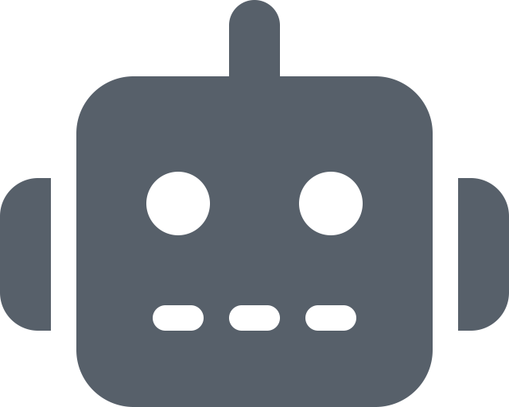
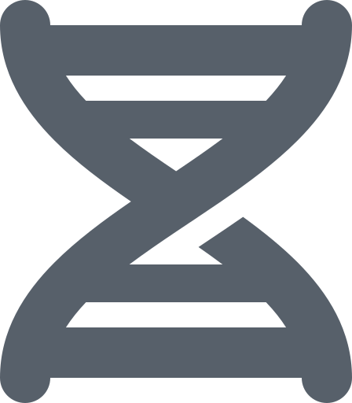
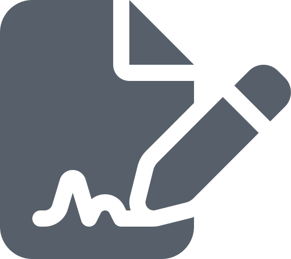
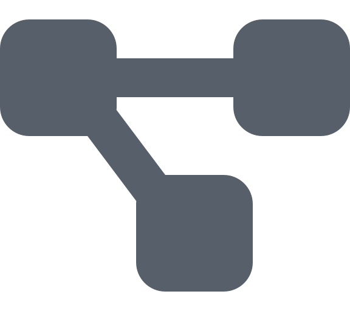
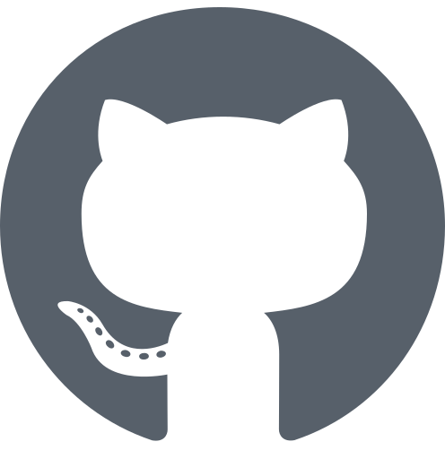

<h1 align="center">Feng GAO</h1>

<p align="center"><strong>Professor of Medical AI @ SYSU</strong></p>
<p align="center">
  <a href="https://tokscale.ai/u/gaofeng21cn">
    
  </a>
</p>
<p align="center">Building clinically grounded medical AI and One Person Lab: OPL Framework, One Person Lab App, and Foundry Agents for stage-led, auditable knowledge delivery.</p>

<table>
  <tr>
    <td width="33%" valign="top" align="center">
      <a href="https://github.com/gaofeng21cn/one-person-lab"></a><br/>
      <strong>OPL Framework</strong><br/>
      <a href="https://github.com/gaofeng21cn/one-person-lab"><code>One Person Lab</code></a><br/>
      Runtime, activation, contracts, recovery, and projection.
    </td>
    <td width="33%" valign="top" align="center">
      <a href="https://github.com/gaofeng21cn/one-person-lab-app"></a><br/>
      <strong>One Person Lab App</strong><br/>
      <a href="https://github.com/gaofeng21cn/one-person-lab-app"><code>One Person Lab App</code></a><br/>
      Desktop workbench and user-facing product surface.
    </td>
    <td width="33%" valign="top" align="center">
      <a href="https://github.com/gaofeng21cn/opl-meta-agent"></a><br/>
      <strong>Agent Foundry</strong><br/>
      <a href="https://github.com/gaofeng21cn/opl-meta-agent"><code>OPL Meta Agent</code></a><br/>
      Build, test, and improve OPL-compatible agents.
    </td>
  </tr>
  <tr>
    <td width="33%" valign="top" align="center">
      <a href="https://github.com/gaofeng21cn/med-autoscience"></a><br/>
      <strong>Research Foundry</strong><br/>
      <a href="https://github.com/gaofeng21cn/med-autoscience"><code>Med Auto Science</code></a><br/>
      Medical research, evidence packages, and manuscripts.
    </td>
    <td width="33%" valign="top" align="center">
      <a href="https://github.com/gaofeng21cn/med-autogrant"></a><br/>
      <strong>Grant Foundry</strong><br/>
      <a href="https://github.com/gaofeng21cn/med-autogrant"><code>Med Auto Grant</code></a><br/>
      Proposal direction, drafting, review, and package export.
    </td>
    <td width="33%" valign="top" align="center">
      <a href="https://github.com/gaofeng21cn/redcube-ai"></a><br/>
      <strong>Presentation Foundry</strong><br/>
      <a href="https://github.com/gaofeng21cn/redcube-ai"><code>RedCube AI</code></a><br/>
      Slide decks and audited presentation artifacts.
    </td>
  </tr>
</table>

## Work

I work on medical AI for colorectal cancer and on One Person Lab: OPL Framework, One Person Lab App, and Foundry Agents for turning high-value knowledge work into recoverable, auditable expert stages. The product family currently centers on research, grants, presentations, agent building, and future professional workflows.

## Projects

<table>
  <tr>
    <th width="24%">Project</th>
    <th width="76%">Role</th>
  </tr>
  <tr>
    <td><a href="https://github.com/gaofeng21cn/one-person-lab"> One Person Lab</a></td>
    <td>OPL Framework for runtime, activation, contracts, progress projection, recovery, and domain-agent coordination</td>
  </tr>
  <tr>
    <td><a href="https://github.com/gaofeng21cn/one-person-lab-app"> One Person Lab App</a></td>
    <td>Desktop workbench, installer, release assets, updater metadata, and user-facing product surface</td>
  </tr>
  <tr>
    <td><a href="https://github.com/gaofeng21cn/opl-meta-agent"> OPL Meta Agent</a></td>
    <td>Agent Foundry for building, testing, and improving OPL-compatible agents</td>
  </tr>
  <tr>
    <td><a href="https://github.com/gaofeng21cn/med-autoscience"> Med Auto Science</a></td>
    <td>Research Foundry agent for study workspaces, evidence packages, manuscripts, and submission materials</td>
  </tr>
  <tr>
    <td><a href="https://github.com/gaofeng21cn/med-autogrant"> Med Auto Grant</a></td>
    <td>Grant Foundry agent for direction screening, proposal drafting, review, and package export</td>
  </tr>
  <tr>
    <td><a href="https://github.com/gaofeng21cn/redcube-ai"> RedCube AI</a></td>
    <td>Presentation Foundry agent for slide decks and audited presentation artifacts</td>
  </tr>
  <tr>
    <td><a href="https://github.com/gaofeng21cn/opl-flow"> OPL Flow</a></td>
    <td>Reusable Codex workflow profile for Direct / Inline / Durable work, role prompts, subagent contracts, and verification discipline</td>
  </tr>
  <tr>
    <td><a href="https://github.com/gaofeng21cn/opl-doc"> OPL Doc</a></td>
    <td>Codex plugin for OPL-native developer-document lifecycle governance and active-truth cleanup</td>
  </tr>
</table>

## Codex Setup

New-machine Codex setup for the OPL runtime, MAS/MAG/RCA/OMA agent surfaces, OPL Flow, OPL Doc, and companion tools starts here:

[One Person Lab new-machine Codex bootstrap guide](https://github.com/gaofeng21cn/one-person-lab/blob/main/docs/references/current-support/opl-new-machine-codex-bootstrap.md)

Paste this into Codex on the new machine:

```text
Please follow the official One Person Lab new-machine guide and set up this machine with the OPL agent runtime environment and the complete Codex workflow toolkit.
Source of truth: https://github.com/gaofeng21cn/one-person-lab/blob/main/docs/references/current-support/opl-new-machine-codex-bootstrap.md
```

## Focus

- Clinically grounded AI for colorectal cancer
- Human-auditable medical research and grant workflows
- Stage-led systems for recoverable, auditable knowledge delivery
- Independent domain agents with clear authority boundaries

## Links

- Academic site: <a href="https://fenggaolab.org"> fenggaolab.org</a>
- GitHub: <a href="https://github.com/gaofeng21cn"> gaofeng21cn</a>
