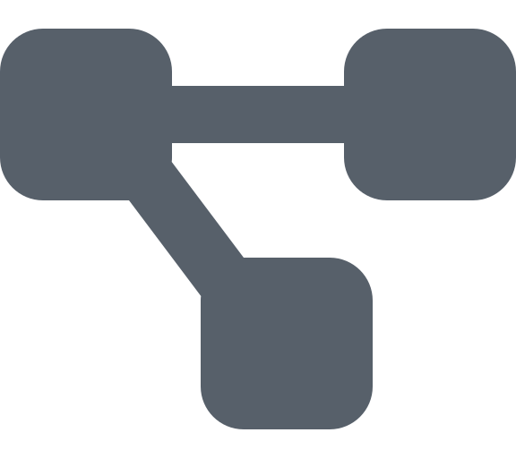
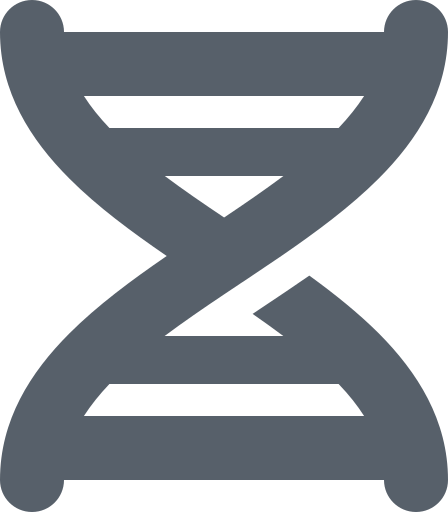
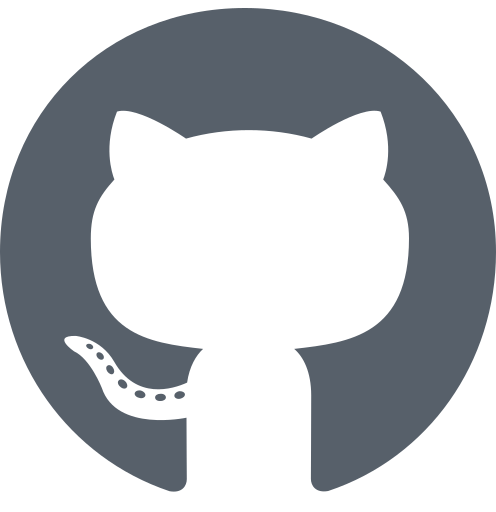

<h1 align="center">Feng GAO</h1>

<strong>Professor of Medical AI · Builder of One Person Lab</strong>

  

Building clinically grounded AI and the coordination infrastructure that turns research and professional knowledge work into recoverable, human-auditable systems across tasks, repositories, and machines.

 

## Core Platform

<table>
  <tr>
    <td width="33%" valign="top" align="center">
       
      <strong>OPL Framework</strong> 
      <a href="https://github.com/gaofeng21cn/one-person-lab"><code>One Person Lab</code></a> 
      Runtime, activation, contracts, recovery, and projection across OPL packages.
    </td>
    <td width="33%" valign="top" align="center">
       
      <strong>One Person Lab App</strong> 
      <a href="https://github.com/gaofeng21cn/one-person-lab-app"><code>One Person Lab App</code></a> 
      The primary user entry point for desktop and browser work.
    </td>
    <td width="33%" valign="top" align="center">
       
      <strong>OPL Flow</strong> 
      <a href="https://github.com/gaofeng21cn/opl-flow"><code>OPL Flow</code></a> 
      Codex experience baseline and coordination across tasks, repositories, and machines.
    </td>
  </tr>
</table>

## Flagship Products

<table>
  <tr>
    <td width="50%" valign="top" align="center">
       
      <strong>OPL Fleet</strong> 
      <a href="https://github.com/gaofeng21cn/opl-fleet-agent"><code>Fleet Agent</code></a>
      ·
      <a href="https://github.com/gaofeng21cn/opl-fleet-cockpit"><code>Fleet Cockpit</code></a> 
      Local-first multi-machine operations: Flow coordinates, Agent reports node activity, and Cockpit visualizes aggregate telemetry.
    </td>
    <td width="50%" valign="top" align="center">
       
      <strong>Research Foundry</strong> 
      <a href="https://github.com/gaofeng21cn/med-autoscience"><code>Med Auto Science</code></a> 
      Clinically grounded research from study questions and evidence to manuscript-ready work.
    </td>
  </tr>
</table>

## Start Here

Most users should start with [One Person Lab App](https://github.com/gaofeng21cn/one-person-lab-app) rather than configuring Codex directly. It packages the OPL workbench, runtime, professional agents, and companion tools behind one product entry point.

[Download the latest release](https://github.com/gaofeng21cn/one-person-lab-app/releases/latest) · [Read the installation guide](https://github.com/gaofeng21cn/one-person-lab-app/blob/main/docs/delivery/install/README.md)

## Foundry Ecosystem

- **Agent Foundry** · [OPL Meta Agent](https://github.com/gaofeng21cn/opl-meta-agent) builds, tests, and improves OPL-compatible agents.
- **Grant Foundry** · [Med Auto Grant](https://github.com/gaofeng21cn/med-autogrant) supports proposal direction, drafting, review, and package export.
- **Presentation Foundry** · [RedCube AI](https://github.com/gaofeng21cn/redcube-ai) creates visual deliverables for presentations and social media.
- **Book Foundry** · [OPL Book Forge](https://github.com/gaofeng21cn/opl-bookforge) develops storylines, chapters, figures, tables, and owner-gated export packages.
- **Health Platform** · [OPL Health Platform](https://github.com/gaofeng21cn/opl-health-platform) brings medical meta-agent capabilities to hospital environments.

  Infrastructure: <a href="https://github.com/gaofeng21cn/one-person-lab-cloud">OPL Cloud</a> for gateway, workspace, console, and evidence services · <a href="https://github.com/gaofeng21cn/opl-doc">OPL Doc</a> for developer-document lifecycle governance

## Links

  Academic site: <a href="https://fenggaolab.org"> fenggaolab.org</a>
  &nbsp;&nbsp;·&nbsp;&nbsp;
  GitHub: <a href="https://github.com/gaofeng21cn"> gaofeng21cn</a>

